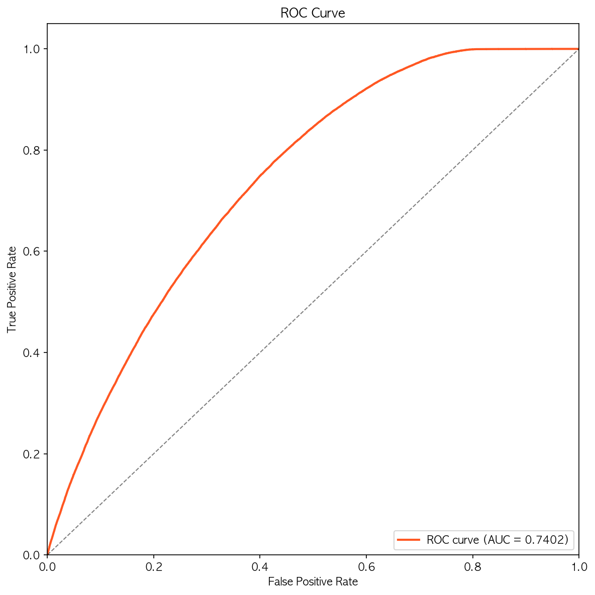
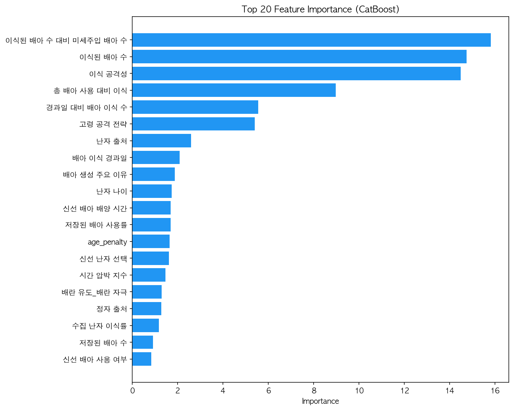
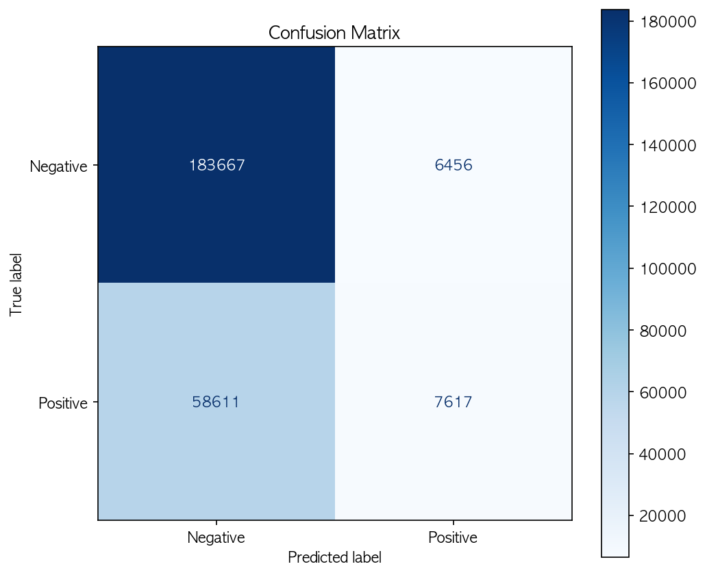

# 🏥 IVF Pregnancy Success Prediction

### 난임 시술 데이터를 활용한 임신 성공 여부 예측

난임 시술 환자의 임상 데이터를 기반으로 **임신 성공 여부를 예측하는 이진 분류 머신러닝 프로젝트**입니다.

IVF/DI 시술 유형, 환자 특성, 배아 상태, 불임 원인 등의 정보를 활용하여

Feature Engineering + Gradient Boosting + Deep Learning 기반 모델을 구축했습니다.

---

# 📋 Project Overview

| 항목 | 내용 |
| --- | --- |
| Task | IVF Pregnancy Success Prediction |
| Problem Type | Binary Classification |
| Evaluation Metric | AUC / F1-score |
| Data | 난임 시술 임상 데이터 |

---

# 🎯 Problem Statement

난임 치료에서는 시술 성공 가능성을 사전에 예측하는 것이 중요합니다.

그러나 실제 임상 데이터에서는

- 환자 나이
- 시술 방식
- 배아 상태
- 불임 원인

등 다양한 요인이 복합적으로 작용하여 **임신 성공 여부를 예측하기 어렵습니다.**

본 프로젝트의 목표는

**난임 시술 환자의 임상 데이터를 기반으로 임신 성공 여부를 예측하는 머신러닝 모델을 구축하는 것**입니다.

---

# 📊 Dataset

데이터는 난임 시술 관련 임상 정보로 구성되어 있습니다.

주요 변수

- 시술 유형 (IVF / DI)
- 환자 나이
- 배아 수
- 난자 상태
- 배아 배양 기간
- 불임 원인
- 시술 시기

데이터 특징

- 다양한 결측치 존재
- IVF / DI 시술 간 feature 구조 차이
- 의료 데이터 특성상 복잡한 변수 상호작용

---

# 🔍 Methodology

## 1️⃣ Data Preprocessing

### Missing Value Imputation

결측치 처리를 위해 **MICE (Multiple Imputation by Chained Equations)** 적용

```
miceforest
```

단순 평균 대체보다 더 안정적인 데이터 복원 가능

---

### Procedure Type Separation

시술 유형에 따라 데이터 특성이 달라

- IVF
- DI

데이터를 **분리하여 전처리 파이프라인 구성**

DI 시술에서는 IVF 전용 변수(배아, 난자 관련 컬럼) 제거

---

## 2️⃣ Feature Engineering

### Ratio Features

- 난자 성공률
- 배아 사용률
- IVF/DI 임신률
- 출산률

---

### Temporal Interaction

시술 시기와 배아 상태 간 상호작용

예시

- 시술 시기 × 배아 사용 여부
- 단일 배아 이식 여부

---

### Age-based Features

- 난자 나이 계산
- 기증 난자 여부
- 고령 환자 penalty feature

---

### Infertility Cause Aggregation

불임 원인을 집계하여

- 남성 불임 지표
- 여성 불임 지표
- 불임 심각도

파생 변수 생성

---

### Embryo Quality Indicators

- 배아 배양 시간
- 신선 배아 / 동결 배아 구분
- 이상적 배양 기간 flag

---

# 🤖 Modeling

## CatBoost

주요 모델

- 25-Fold Stratified K-Fold Cross Validation

```
iterations = 3000
depth = 7
learning_rate = 0.0594
```

CatBoost는 **categorical feature 처리에 강점**이 있어 주요 모델로 활용했습니다.

---

## Additional Models

### LightGBM

- Optuna 기반 하이퍼파라미터 튜닝

### TabNet

- DAE(Denoising AutoEncoder) 기반 latent representation 활용

### AutoGluon

- AutoML 기반 baseline 모델

### Neural Network

- MLP
- CNN

DAE 기반 latent feature 활용

---

# 🔗 Ensemble Strategy

각 모델의 **OOF (Out-of-Fold) prediction**을 활용하여

**Weighted Blending Ensemble** 수행

또한 **Threshold Optimization**을 통해

F1-score 기준 성능을 최적화했습니다.

---

# 📁 Project Structure

```
ivf-pregnancy-prediction/
├── data/                          # 원본 데이터 (gitignore)
│
├── notebooks/                     # 분석 및 모델링 노트북
│   ├── 01_EDA.ipynb               # 탐색적 데이터 분석
│   ├── 02_Preprocessing.ipynb     # Feature Engineering + 전처리
│   ├── 03_Modeling.ipynb          # 모델 학습 (CatBoost / LightGBM 등)
│   └── 04_Evaluation.ipynb        # 모델 평가 및 결과 분석
│
├── outputs/                       # 결과 파일
│   └── figures/                   # 시각화 결과
│       ├── feature_importance.png
│       ├── roc_curve.png
│       └── confusion_matrix.png
│
├── requirements.txt
└── README.md
```

---

# 🛠 Tech Stack

| Category | Tools |
| --- | --- |
| Language | Python |
| Data Processing | Pandas, NumPy |
| Missing Value Imputation | miceforest (MICE) |
| Machine Learning | CatBoost, LightGBM |
| Deep Learning | PyTorch |
| AutoML | AutoGluon |
| Hyperparameter Tuning | Optuna |
| Validation | Stratified KFold |

---

# 📈 Results

## ROC Curve



## Feature Importance (Top 20)



## Confusion Matrix



---

# 💡 Key Insights

- **IVF / DI 분리 모델링**이 통합 모델보다 더 안정적인 성능을 보임
- **MICE 기반 결측치 보간**이 단순 대체 대비 성능 개선
- **시술 시기 × 배아 상태 상호작용 피처**가 예측 성능에 중요한 역할
- **나이 기반 파생 변수**가 임신 성공 예측에서 핵심 feature로 작용

🚀 How to Run
pip install -r requirements.txt

노트북 실행 순서

01_EDA.ipynb
→ 02_Preprocessing.ipynb
→ 03_Modeling.ipynb
→ 04_Evaluation.ipynb